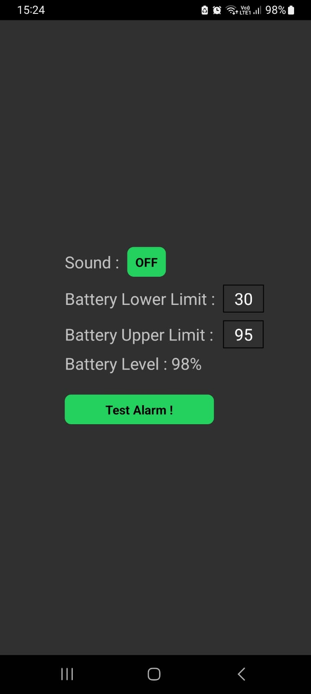
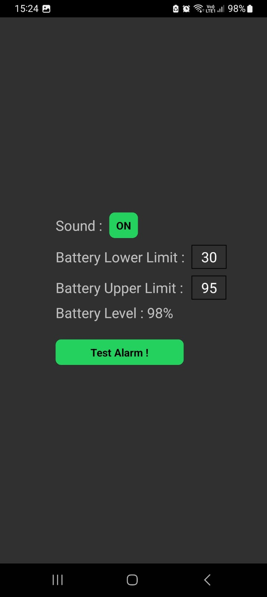

### React Native Battery Level Alarm Example

 

## Installation
> yarn add react-native-device-info  
> yarn add @gemedico/react-native-sounds  
> yarn add @react-native-async-storage/async-storage 

Files edited:
1. App.tsx

## Resolve Error :  "AAPT: error: resource android:attr/lStar not found."
node_modules\@gemedico\react-native-sounds\android\build.gradle - Edited :15 to :16
```        
    compileSdkVersion 33
    buildToolsVersion "33.0.0"
```
## Run Release APK on emulator/phone
> source Build_Release_APK.sh

For Release version of APK, this speeds up the app boot time.

## How to use?
1. Plug in your charger to your phone and open this app.
When you first open the app, your phone will ring off, this is the sound, you will hear ;
A. When battery level is lower than Battery Lower Limit
B. When battery level is higher than Battery Upper Limit

2. Set your limits, then toggle SOUND to OFF, (this will auto save your settings to AsyncStorage)
Then you may keep this app in the background, and plug in to charge your phone, your phone will ring off when battery level exceeds Battery Upper Limit.

3. Regardless whether you mute your phone, the alarm will go off, this i believe is due to the tone i set to, which is 'AndroidSoundIDs.TONE_CDMA_HIGH_PBX_L'
*This code is strictly for Android only, if you are using iOS, you can use iOSSoundIDs to set the tone

*Note that whenever you unplug or plug in your phone, the alarm will go off, just press on Sound Toggle button 'OFF', to set the alarm off!
This could be due to the nature of the plugin '@gemedico/react-native-sounds' i use.

## License

Library 'react-native-device-info' is licensed under [The MIT License](https://mit-license.org/).  
Library '@gemedico/react-native-sounds' is licensed under [The MIT License](https://mit-license.org/).  
Library '@react-native-async-storage/async-storage' is licensed under [The MIT License](https://mit-license.org/).  

## Credits

Regarding main project 'react-native-device-info', please refer to 'https://github.com/react-native-device-info/react-native-device-info'.  
Regarding main project '@gemedico/react-native-sounds', please refer to 'https://github.com/Gemedico/react-native-sounds'.  
Regarding main project '@react-native-async-storage/async-storage', please refer to 'https://github.com/react-native-async-storage/async-storage'.  


